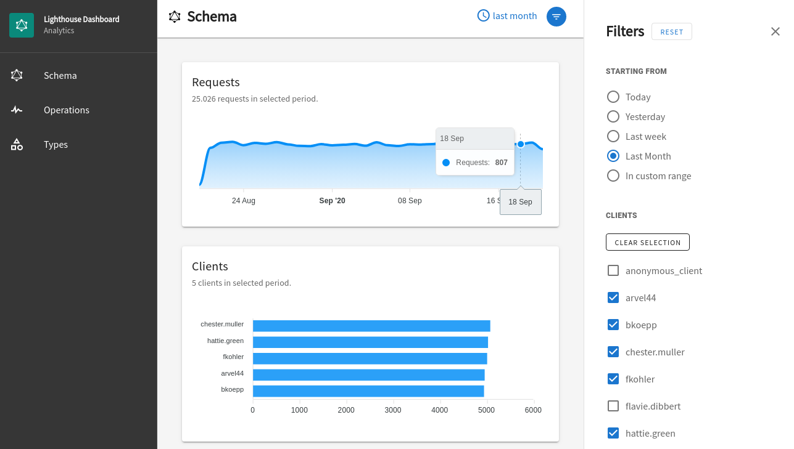
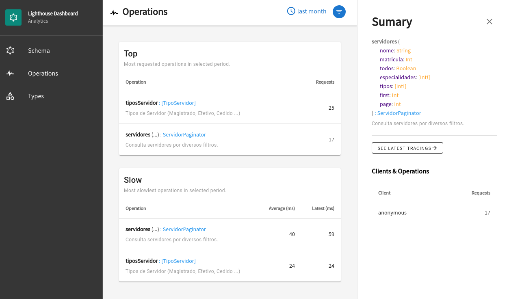
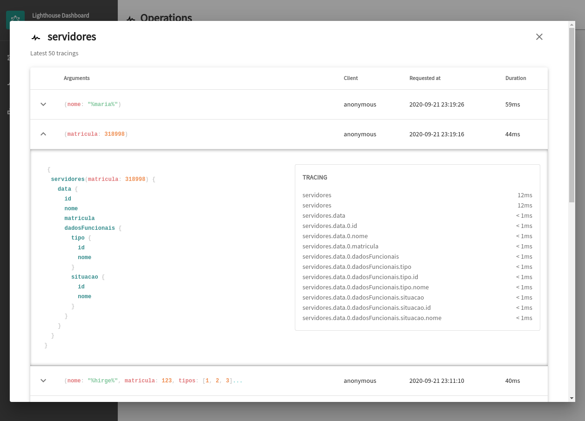
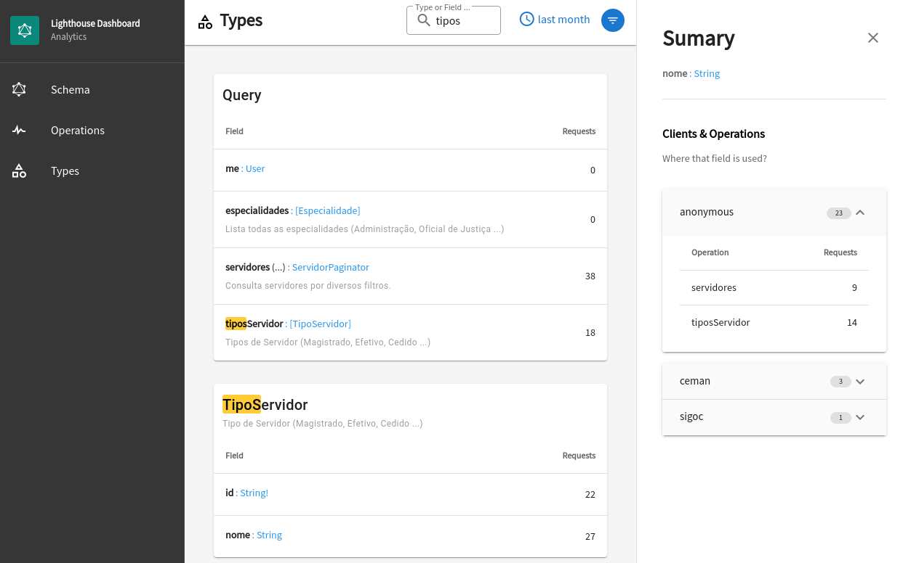
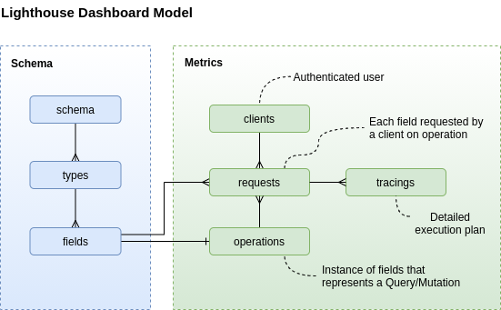

<p align="center">
    
</p>
<p align="center">
    
    
    
    <a href="https://join.slack.com/t/lighthousedashboard/shared_invite/zt-hyqiy6fk-HHrxTH_nJH7VtfKfuCSv5Q">
    
    </a>
</p>

# Dashboard for Laravel Lighthouse GraphQL

**:warning: WORK IN PROGRESS!**

This package adds a standalone analytics dasbhoard with metrics collected from  [Laravel Lighthouse GraphQL Server](https://lighthouse-php.com/).

Requirements:

- Laravel >= 8.x
- Laravel Lighthouse >= 5.x

Questions? Join us in [Slack Channel](https://join.slack.com/t/lighthousedashboard/shared_invite/zt-hyqiy6fk-HHrxTH_nJH7VtfKfuCSv5Q).

<br>
<kbd>
    
</kbd>
<br><br>
<kbd>
    
</kbd>
<br><br>
<kbd>
    
</kbd>
<br><br>
<kbd>
    
</kbd>

# Install 

Require the package.

```
composer require robsontenorio/lighthouse-dashboard
```


Publish package assets.

```
php artisan lighthouse-dashboard:publish
```

Configure the package.

```php
// config/lighthouse-dashboard.php

return [
    /**
     * Authenticated user attribute for identify the current client.
     * 
     * If there is no authenticated user a `anonymous` will be used.
     * Default is `Auth::user()->username`
     */

    'client_identifier' => 'username',

    /**
     * Database connection name for the dashboard.
     * 
     * By default it uses different connection. You must create it.
     * Or set it to `null` if want to use same connection from target app.
     */

    'connection' => 'dashboard',
];
```

Run package migrations.

```
php artisan lighthouse-dashboard:migrate
```

Open the dashboard.

```
http://your-app/lighthouse-dashboard
```

To keep the assets up-to-date and avoid issues in future updates, we highly recommend adding the command to the post-autoload-dump section in your `composer.json` file:

```json
{    
    "scripts": {
        "post-autoload-dump": [            
            "@php artisan lighthouse-dashboard:publish"
        ]
    }
}
```

# How does it works?

<details>
<summary>See more ...<br><br></summary>

By enabling `Tracing` extension on Laravel Lighthouse GraphQL Server, every operation automatically is profiled with its execution metrics.

- GraphQL request is made.
- Dashboard listen to `ManipulateResult` event and collect metrics from current operation.
- Metrics are stored on dashboard.

The GraphQL server performance is not affected by this package, once metrics are collect after response is sent by server.
</details>

# Configurations

<details>
<summary>See more ...<br><br></summary>

/config/lighthouse-dashboard.php
```php
return [
    /**
     * Authenticated user attribute for identify the current client.
     * 
     * If there is no authenticated user an `anonymous` client will be used.
     * Default is `Auth::user()->username`
     */

    'client_identifier' => 'username',

    /**
     * Database connection name for the dashboard.
     * 
     * By default it uses different connection. You must create it.
     * Or set it to `null` if want to use same connection from target app.
     */

    'connection' => 'dashboard',

     /**
     * Silent tracing.
     * 
     * This package auto-register TracingServiceProvider from "nuwave/lighthouse".     
     * This is a required feature to make this package working.     
     * 
     * But if you do not want including tracing output on server response just set it to `true`.
     * 
     */
    'silent_tracing' => false
];
```
</details>

# Local development

<details><summary>See more ...<br><br></summary>

Once this package includes UI, the only way to test it is by running it through target app.

### Uninstall  

If you previous installed this package, **first uninstall it from target app**.

Remove this entry from `composer.json`.

```json
{    
    "scripts": {
        "post-autoload-dump": [ 
            "@php artisan lighthouse-dashboard:publish"
        ]
    }
}
```

Remove package.

```
composer remove robsontenorio/lighthouse-dashboard
```

Remove package public assets from target app.

```
rm -rf /path/to/app/public/vendor/lighthouse-dashboard
```

### Install locally

Clone the repository, then on target app add to `composer.json`

```json
 "repositories": {
        "robsontenorio/lighthouse-dashboard": {
            "type": "path",
            "url": "/local/path/to/lighthouse-dashboard",
            "options": {
                "symlink": true
            }
        }
    }
```

Require local package version.

```sh
composer require robsontenorio/lighthouse-dashboard @dev
```

Create symlink from target app `/public` assets to local package assets.

```sh
ln -s /path/to/app/vendor/robsontenorio/lighthouse-dashboard/public/vendor /path/to/app/public/vendor
```

From target app enter to package vendor folder.

```sh
cd vendor/robsontenorio/lighthouse-dashboard
```

Install composer dependencies.

```sh
composer install
```

Install frontend dependencies and start it on dev mode.

```sh
yarn dev
```

Then point to http://localhost:3000/lighthouse-dashboard/


## Reference model



</details>

# Tests

<details>
<summary>See more ...<br><br></summary>

```bash
# run once
composer test

# run in watch mode
composer test:watch

# run once with coverage report in terminal
# see full report in ./coverage/html/index.html
composer test:coverage
```

If you need to tweak UI see "Local development" section.
</details>


# Roadmap

- [ ] Error tracking.
- [ ] Sumary for operations per clients.
- [ ] UI navigation with anchor href when clicks on type return.
- [ ] Add option to guard dashboard.
- [ ] Add option for retention period.

# Credits

Developed by [Robson Tenório](https://twitter.com/robsontenorio) and [contributors](https://github.com/robsontenorio/lighthouse-dashboard/graphs/contributors).

This work is highly inspired on [Apollo Studio](https://studio.apollographql.com/) and powered by:

- Laravel.
- Lighthouse GraphQL.
- InertiaJS.
- Vuetify.
