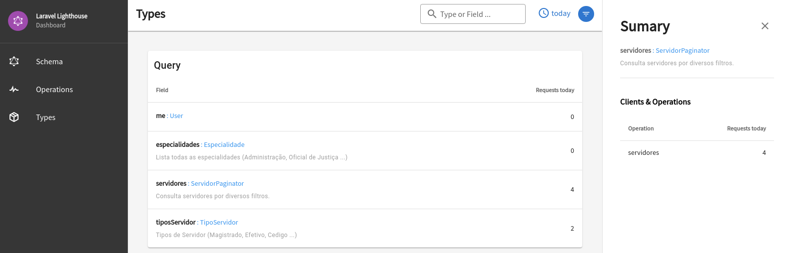

<p align="center">
    
</p>
<p align="center">
    
    
</p>

# Dashboard for Laravel Lighthouse GraphQL

**:warning: WORK IN PROGRESS!**

This package adds a standalone analytics dasbhoard with metrics collected from  [Laravel Lighthouse GraphQL Server](https://lighthouse-php.com/).

Requirements:

- Laravel 8.x
- Laravel Lighthouse 5.x

<kbd>
    
</kbd>

# Install 

Enable the `Tracing` extension, by adding the service provider to your `config/app.php`, as described on oficial Lighthouse GraphQL documentation. Note this is not a feature from this package.

```php
'providers' => [
    \Nuwave\Lighthouse\Tracing\TracingServiceProvider::class,
],
```

Require the package.

```
composer require robsontenorio/lighthouse-dashboard
```


Publish package assets.

```
php artisan lighthouse-dashboard:publish
```

Configure the package.

```php
// config/lighthouse-dashboard.php

return [
    /**
     * Authenticated user attribute for identify the current client.
     * 
     * If there is no authenticated user a `anonymous_client` will be used.
     * Default is `Auth::user()->username`
     */

    'client_identifier' => 'username',

    /**
     * Database connection name for the dashboard.
     * 
     * By default it uses different connection. You must create it.
     * Or set it to `null` if want to use same connection from target app.
     */

    'connection' => 'dashboard',
];
```

Run package migrations.

```
php artisan lighthouse-dashboard:migrate
```

Open the dashboard.

```
http://your-app/lighthouse-dashboard
```

To keep the assets up-to-date and avoid issues in future updates, we highly recommend adding the command to the post-autoload-dump section in your `composer.json` file:

```json
{
    ...
    "scripts": {
        "post-autoload-dump": [
            ...
            "@php artisan lighthouse-dashboard:publish"
        ]
    }
}
```

# How does it works?

<details>
<summary>See more ...<br><br></summary>

By enabling `Tracing` extension on Laravel Lighthouse GraphQL Server, every operation automatically is profiled with its execution metrics.

- GraphQL request is made.
- Dashboard listen to `ManipulateResult` event and collect metrics from current operation.
- Metrics are stored on dashboard.

The GraphQL server performance is not affected by this package, once metrics are collect after response is sent by server.

By default, metrics are stored on same target app database. But if you want to keep things separated you can select a different database connection to store metrics.
</details>

# Configuration


<details>
<summary>See more ...<br><br></summary>

/config/lighthouse-dashboard.php
```php
return [
    /**
     * Authenticated user attribute for identify the current client.
     * 
     * If there is no authenticated user a `anonymous_client` will be used.
     * Default is `Auth::user()->username`
     */

    'client_identifier' => 'username',

    /**
     * Database connection name for the dashboard.
     * 
     * By default it uses different connection. You must create it.
     * Or set it to `null` if want to use same connection from target app.
     */

    'connection' => 'dashboard',
];
```
</details>

# Local development

<details><summary>See more ...<br><br></summary>

Once this package includes UI, the only way to test it is by running it through target app.

### Uninstall  

If you previous installed this package, first uninstall it **from target app**.

Remove this entry from `composer.json`.

```json
{
    ...
    "scripts": {
        "post-autoload-dump": [
            ...
            "@php artisan lighthouse-dashboard:publish"
        ]
    }
}
```

Remove installed package assets folder.

```
rm -rf /path/to/app/public/vendor/lighthouse-dashboard
```

Remove package.

```
composer remove robsontenorio/lighthouse-dashboard
```

Then package public assets from target app.

```
rm -rf /path/to/app/public/vendor/lighthouse-dashboard
```

### Install locally

On target app add to `composer.json`

```json
 "repositories": {
        "robsontenorio/lighthouse-dashboard": {
            "type": "path",
            "url": "/local/path/to/package/lighthouse-dashboard"
        }
    }
```

Require local package version.

```sh
composer require robsontenorio/lighthouse-dashboard @dev
```

Create symlink from target app `/public` assets to this package assets.

```sh
ln -s /path/to/app/vendor/robsontenorio/lighthouse-dashboard/public/vendor /path/to/app/public/vendor
```

From target app enter to package vendor folder.

```sh
cd vendor/robsontenorio/lighthouse-dashboard
```

Install composer dependencies.

```sh
composer install
```

Install frontend dependencies and start it on dev mode.

```sh
yarn dev
```

Then point to http://localhost:3000/lighthouse-dashboard/

</details>

# Tests

WIP.

# Roadmap

- [ ] Welcome page with sumary.
- [ ] Cool charts for operations.
- [ ] Real time charts. Pooling is ok for now.
- [ ] Sumary for operations per clients.
- [ ] UI navigation with anchor href on click type return.
- [ ] Add option to guard dashboard.
- [ ] Add option for retention period.

# Credits

Developed by [Robson Tenório](https://twitter.com/robsontenorio) and [contributors](https://github.com/robsontenorio/lighthouse-dashboard/graphs/contributors).

This work is highly inspired in [Apollo Studio](https://studio.apollographql.com/) and powered by:

- Laravel.
- Lighthouse GraphQL.
- InertiaJS.
- Vuetify.
